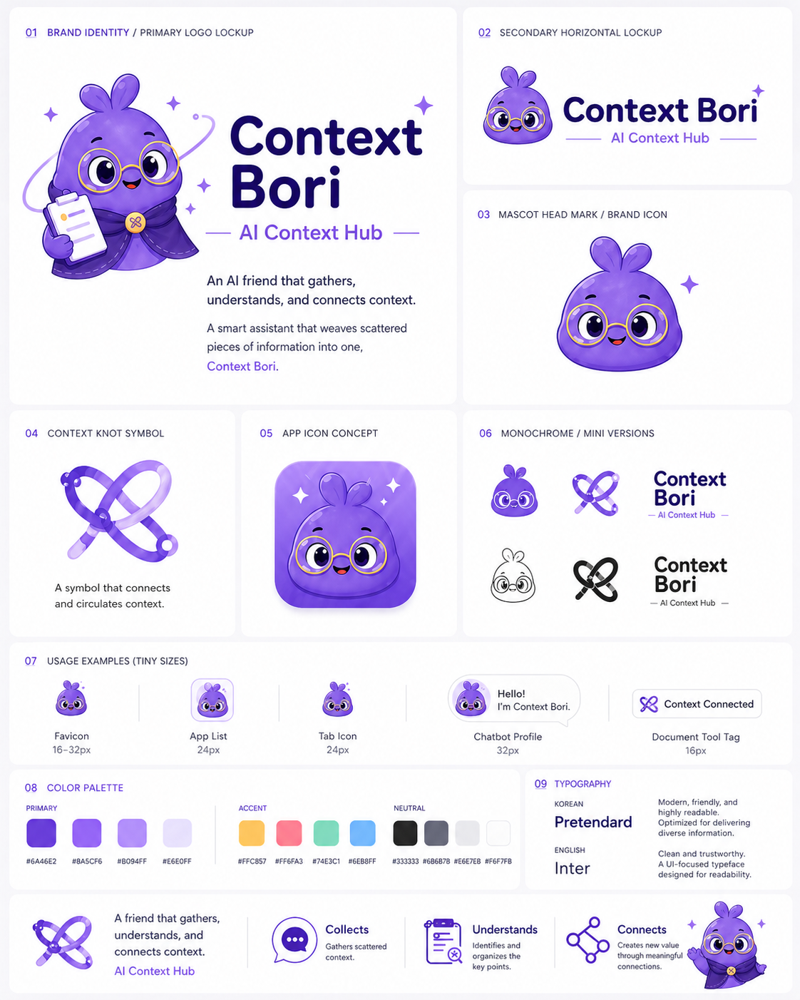
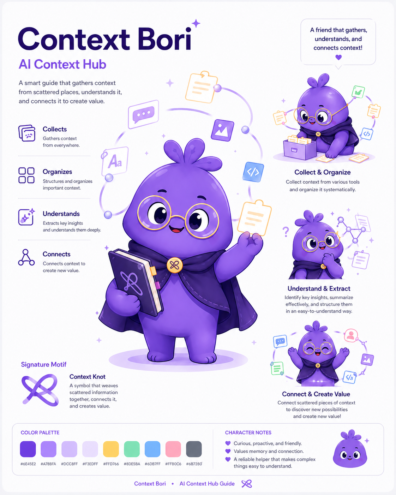

# Context Boradori

[한국어](./README.md) | [English](./README.en.md)

**Context Boradori** is a personal AI context hub for people who work across ChatGPT, Claude, Codex, Gemini, and other AI tools.

Paste scattered AI work context, and the app turns it into a session summary, decisions, open questions, next actions, handoff markdown, and agent instruction exports that the next AI can continue from.

## Demo

- Live demo: [https://context-boradori.vercel.app](https://context-boradori.vercel.app)
- English view: [https://context-boradori.vercel.app/?lang=en](https://context-boradori.vercel.app/?lang=en)

## Problem

When people use several AI tools on the same project, the working context becomes fragmented. Decisions, open questions, and next actions get trapped in separate chats, and the user has to explain the same background again and again.

Context Boradori collects those fragments into one shared project memory so the next AI tool can continue in the same direction.

## Solution

Users paste work context from ChatGPT, Claude, Codex, Gemini, or another AI tool. The MVP runs local mock compression in the browser, organizes the context, and merges multiple tool sessions into one common handoff.

The key idea is not just summarization. It is the **north star**: confirmed decisions, open questions, and next actions are tied to one shared direction so future work stays aligned across tools.

## MVP Features

- Project name input
- Source AI tool selector
- Target AI tool selector
- Raw context paste area
- Local mock compression with no external AI API
- Multi-source common context tray
- Common handoff merge from multiple AI tool sessions
- Visual common-context map with a north-star direction
- Editable project north star
- Korean/English UI toggle
- Browser `localStorage` persistence for demo continuity
- Session summary, decisions, proposed ideas, open questions, next actions
- `handoff.md`, `AGENTS.md`, `CLAUDE.md`, `GEMINI.md` exports
- Copy buttons and markdown downloads
- Public repo safety warning
- Basic redaction for common API key/token patterns

## User Flow

1. Enter a project name and choose the source AI tool.
2. Paste raw context from that tool.
3. Add the context piece to the common tray.
4. Review or edit the project north star.
5. Choose the target AI tool and merge the common context.
6. Review the common-context map and handoff exports.
7. Copy or download the result for the next AI tool.

## Brand

Context Boradori is a cute but smart AI context librarian. The brand verbs are **collect, understand, compress, connect**.





## Security Note

Do not paste API keys, passwords, tokens, private URLs, or private financial information into this app.

The current MVP does not call external AI APIs and does not send raw context to a server. The common tray is stored only in the current browser for demo continuity. Future AI/API features should add stronger redaction and explicit user consent before sending any content outside the browser.

## Local Development

```bash
npm install
npm run dev
```

Open:

[http://localhost:3000](http://localhost:3000)

Useful checks:

```bash
npm run lint
npm run build
npm audit --omit=dev
```

## Project Memory

The shared project memory lives in `.ai/`:

- `.ai/project_brief.md`
- `.ai/current_state.md`
- `.ai/next_actions.md`
- `.ai/decisions/`
- `.ai/handoffs/`

## Roadmap

- Browser click-through QA for sample context, merge, copy, and downloads
- Product-flow screenshots for README
- Conflict detection between AI tool suggestions
- IndexedDB-based local persistence
- Stronger secret redaction
- Real compression route with Vercel AI SDK
- Streaming result UI
- GitHub PR/export workflow
- MCP or CLI integrations for agent handoff

## License

MIT License. See [`LICENSE`](./LICENSE).
