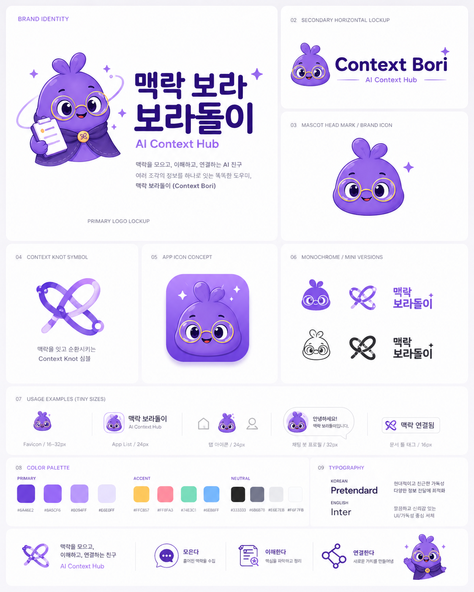
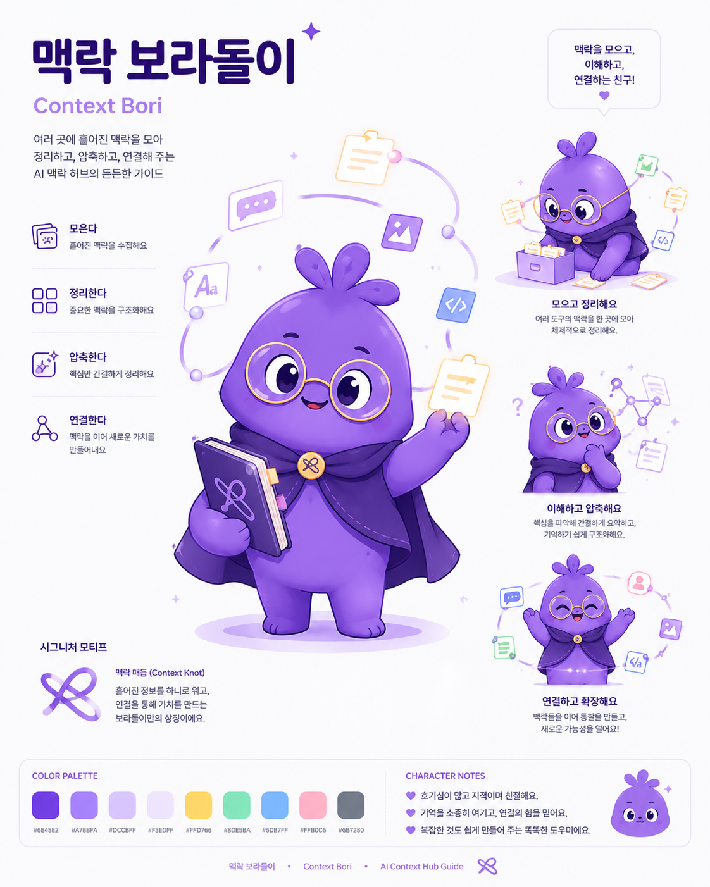

# 맥락 보라돌이

**Context Boradori** is a tiny AI context hub for people who work across ChatGPT, Claude, Codex, Gemini, and other AI tools.

한국어 제품명은 **맥락 보라돌이**입니다. 흩어진 AI 작업 맥락을 붙여넣으면, 다음 AI가 바로 이어받을 수 있도록 요약, 결정사항, 열린 질문, 다음 액션, handoff markdown을 만들어주는 해커톤 MVP입니다.

## Problem

여러 AI 도구를 함께 쓰면 대화 맥락과 작업 이력이 도구마다 흩어집니다. 같은 설명을 반복하게 되고, 결정사항과 다음 액션이 쉽게 유실됩니다.

## Solution

맥락 보라돌이는 사용자가 붙여넣은 raw context를 브라우저 안에서 구조화합니다. MVP에서는 외부 AI API를 호출하지 않고, 규칙 기반 mock compression으로 데모 가능한 흐름을 먼저 완성했습니다.

핵심 흐름은 여러 도구의 맥락 조각을 모아 하나의 공통 프로젝트 기억으로 병합한 뒤, 다음에 사용할 AI 도구용 handoff로 다시 내보내는 것입니다.

## MVP Features

- Project name input
- Source AI tool selector
- Target AI tool selector for common handoff
- Raw context paste area
- Local mock compression
- Multi-source context tray
- Common context merge from multiple AI tool sessions
- Visual common-context map with a north-star handoff direction
- Editable project north star that carries into exported handoff files
- Browser-only saved context pieces for demo continuity
- Session summary, decisions, proposed ideas, open questions, next actions
- Handoff markdown export
- `AGENTS.md`, `CLAUDE.md`, `GEMINI.md` export previews
- Copy buttons and markdown downloads
- Public repo safety warning
- Simple sensitive text redaction for common API key/token patterns

## Demo

Live demo:

[https://context-boradori.vercel.app](https://context-boradori.vercel.app)

## Brand Identity

맥락 보라돌이는 귀엽지만 똑똑한 AI context librarian입니다. 브랜드 키워드는 **모은다, 이해한다, 압축한다, 연결한다**입니다.





## Screenshots

Product flow screenshots will be added after the browser QA pass.

## Local Development

```bash
npm install
npm run dev
```

Open:

[http://localhost:3000](http://localhost:3000)

Useful checks:

```bash
npm run lint
npm run build
npm audit --omit=dev
```

## Security Note

Do not paste API keys, passwords, tokens, private URLs, or private financial information into this app.

The current MVP does not call external AI APIs and does not send raw context to a server. The multi-source tray stores generated context pieces in this browser only for demo continuity. Future AI/API features should add stronger redaction and explicit user consent before sending any content outside the browser.

## Project Memory

The shared project memory lives in `.ai/`:

- `.ai/project_brief.md`
- `.ai/current_state.md`
- `.ai/next_actions.md`
- `.ai/decisions/`
- `.ai/handoffs/`

## Roadmap

- Browser click-through QA for multi-source sample context, merge, copy, and downloads
- Conflict detection between AI tool sessions
- Local browser persistence with IndexedDB
- Stronger secret redaction
- Real LLM compression route using Vercel AI SDK
- Streaming result UI
- GitHub PR/export workflow
- MCP or CLI integrations for agent handoff

## License

MIT License. See [`LICENSE`](./LICENSE).
